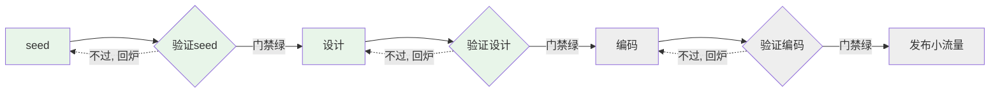

# 流程引擎蓝图(骨架)

> 给 AI 的推进机制。种子(seed 四件套)解决了"一次自驱任务的起点是什么",这份文档解决"拿到种子之后,怎么沿一条固定、可预测的轨道推进到上线"。任意空会话拿到一颗种子,都应据此推进,而不是自己发明流程。仓库定位与铁律见 [../CLAUDE.md](../CLAUDE.md),操作层 PR 流程见 [../CONTRIBUTING.md](../CONTRIBUTING.md)。
>
> **当前是骨架版本**:近期三环节(seed → 验证seed → 设计)给出可执行的门禁判据;靠后四环节(验证设计 → 编码 → 验证编码 → 发布小流量)只留占位骨架,标注为 stub,写清夯实触发条件。骨架的价值是"一眼看到全流程 + 近期能真跑"。

---

## 为什么是"引擎"而不是一张 checklist

checklist 是给人看、靠人记住"现在到哪了"的静态清单;它没有"当前状态"这个概念,也不回答"一个空会话进来怎么知道从哪续"。而纯 AI 自驱的核心痛点恰恰是**空会话没有记忆**——一张清单贴在那儿,空会话读完还是不知道自己站在管线第几格。

所以要的不是清单,是一个能跑"读状态 → 算下一步 → 执行当前环节 → 写回"这个循环的东西。这正是引擎和清单的分界:**引擎有状态机语义,清单没有**。本文档定义的就是这台引擎的管线、每格的门禁、状态从哪读、断点怎么续。

---

## 调度 / 业务分离:一张职责对照表

成熟工作流引擎(如 Temporal、GitHub Actions 的 runner/step 模型)的核心是"编排逻辑"与"步骤内业务"两张皮:引擎只搬状态、算下一步、判关卡、调起环节;环节内部出什么设计、写什么码、跑什么验证,引擎一概不看。

这条边界**推错了代价很高**——若不划清,靠后环节被夯实时极易把大量业务判据糊进"引擎"里,长成环节耦合的大泥球。所以现在就立。但**骨架阶段只把它立成下面这张职责对照表(概念契约),不建任何调度器 interface / 环节注册表 / 状态机类**——那些结构化抽象要到多环节真实运行、多种子并发这类活动真正发生时再定,现在造就是为终态提前抽象,违反 TBD 收敛铁律。

| 引擎管的(调度) | 环节自己管的(业务) |
|---|---|
| 从 git/PR 事实读出"当前在哪一环节" | 产出物本身(种子文件、设计文档、代码) |
| 按管线算出下一步是哪一环节 | 该环节自己声明的验证器 |
| 判断这条边是不是人工关卡(PR) | 跑验证、判断验证是否通过 |
| 驱动环节内自旋(验证不过→回炉重验) | 门禁的结论(pass / 回炉) |
| 在环节转绿、要进 main 时调起 PR | 环节内的具体技术判断 |

读这张表的方式:**任何一段逻辑,先问它属于左列还是右列**。属于左列才进"引擎",属于右列留在环节内。后续实现 skill 时,这张表是划分职责的权威依据。

---

## 管线全景

固定管线由 7 格构成,每个产出格后面紧跟一个验证格:



> 绿色 = 本骨架已给可执行判据;灰色 = stub,后续章节夯实。

---

## 验证格不是独立步骤,是环节的出口门禁

管线画成 7 格是为了"一眼看到全流程",但**语义上验证格不是产出格之后另起的一步,而是产出格的出口条件在管线视图上的投影**。

若真把验证当成事后独立步骤,就违背了 lab 公理"**验证器先于/伴随产物**"——那等于"先随便产出、产出完再补验证",而这正是种子四件套要反对的:种子里"成功标准"和"验证器声明"是绑定写的,不是产出完再补第五步。

所以每一个产出环节内部,都是一个内聚循环:

```
声明验证器 → 产出 → 自验证 → (不过则修正、重验,环节内自旋)
```

"设计做完"的定义,就是"设计环节自己声明的验证器全绿"。管线里那个"验证设计"格,是这个循环的出口门禁投影,不是设计之后的一个平行格子。图中虚线回炉说明:验证不过不是失败退出,而是环节内自旋——这段往复轨迹正是 lab"过程可见"要展示的产物。

---

## 逐环节门禁判据

门禁判据复用种子 0001 已经实战打磨过的**自动层 / 人工层分层裁决**模式:能机械裁决的进自动层(AI 自己跑),只能靠人看 diff 的进人工层(落在 PR review)。

### 环节 A:seed → 验证seed(已就位)

- **产出**:一份填好四件套的种子文件(`seeds/NNNN-*.md`)。
- **自动层门禁**(可逐条对照机械裁决):
  1. 四个字段(意图 / 边界 / 成功标准 / 验证器声明)均非空。
  2. 成功标准逐条可观察、可判定——有明确的可裁决对象,不含"做得好 / 更完善"这类主观词。
  3. 每条成功标准都能在验证器声明里找到对应的验证器,不存在没有验证器的裸标准。
- **人工层门禁**(PR review):边界是否真的划住了圈外——需要人对着终态主题判断。
- **放行**:四件套完整 + 每条成功标准挂得上验证器 + 人工确认边界合理。

> 这里的自动层判据是**结构性**的(字段级、覆盖级、可机械对照),不是"内容写得好不好"。骨架阶段能踩实的只有结构性判据;内容质量本身属于人工层。这条边界后续实现 skill 时不变。

### 环节 B:设计 → 验证设计(已就位)

- **产出**:一份设计文档(技术方案 / 模块切分 / 接缝定义),对齐种子的边界与成功标准。
- **自动层门禁**(可逐条对照裁决):
  1. 设计文档存在。
  2. 种子每条成功标准都能在设计里找到"由哪个模块 / 接缝负责兑现"的落点(标准 → 设计落点的覆盖检查)。
  3. 设计没有引入种子边界圈外的东西(例:种子声明"只读",设计里不得出现写操作)。
- **人工层门禁**(PR review):技术选型是否合理、接缝切得对不对。
- **放行**:成功标准全被设计覆盖 + 不越边界 + 人工确认方案。

### 环节 C:编码 → 验证编码(stub · 后续章节夯实)

- **产出(占位)**:按设计产出的代码 + 该切片自带的验证器(测试 / tsc / lint / CI)。
- **门禁判据**:待后续章节夯实。骨架阶段只声明一条不变的约束——**验证器必须随代码一起产出**(对齐 seed 0001 验证器声明的自动层:CI 绿 / 测试全过 / tsc 过),不细化具体判据清单。
- **为什么现在不展开**:约束它的活动(真实写码、真实跑 CI)还没发生;且 seed 0001 已把"这一颗种子的编码验证"定得很细,通用的"编码环节门禁"应从若干颗种子的实战里归纳,而非现在凭一颗种子提前发明。
- **夯实触发条件**:第一颗种子真正进入编码、CI 真实跑起来之后,回来把通用门禁清单归纳进来。

### 环节 D:发布小流量(stub · 后续章节夯实)

- **产出(占位)**:小流量放量 + 观测。
- **门禁判据**:待后续章节夯实。涉及观测接入(如 Sentry)、放量比例、回滚线等。
- **为什么现在不展开**:依赖的能力(线上环境、观测工具链)现在一个都没就位;放量策略必须结合真实产物形态定,现在定是空对空。
- **夯实触发条件**:线上环境与观测工具链接入、且有可发布的产物之后,再定放量与回滚机制。

---

## 人工关卡:卡在环节间的 PR 边界

纯 AI 自驱不等于全程无人。人工关卡在哪,lab 定位其实已经给死了:**人只在 PR + comment 处介入**。把它落到管线上:

- 铁律 1 规定一切改动走 PR 合入 main。管线每个环节的产出(种子文件、设计文档、代码)都是要进 main 的改动,所以**每个环节的产出天然就是一个 PR,环节的"放行"就是这个 PR 被 merge**。不需要另造关卡介质——PR 就是关卡。
- 分工:**AI 跑完环节的自动层判据,把结论写进 PR 描述;人在 PR 上做人工层裁决(边界合不合理、方案对不对、diff 是否只动该动的),点 merge = 放行。**
- **引擎自动驱动"环节内循环"(验证不过→修正→重验,AI 自己转);人卡在"环节间的 PR 边界"。** 只有环节转绿、要进 main 时才碰 PR 关卡。这条边界让"纯 AI 自驱"和"人只在 PR 介入"两个定位自洽。
- **发布小流量 → 放量这条边尤其必须人卡**:放量是外向、难回滚的动作,不能由 AI 自动通过。

---

## 状态与断点恢复:纯从 git/PR 事实反推

**不引入任何状态组件、不加镜像字段、不改种子模板。** 当前推进到哪一步,完全由 git 分支的存在性 + 对应 PR 的 open/merged 状态承载。

理由:lab 目标函数是**过程可见**。git 分支和 PR 状态本就是"这颗种子推进到哪"的最真实、最不易漂的记录——它们是**事实本身**,不是对事实的二次记录。任何镜像字段(种子里写一行"进度:…"、或独立 `state.json`)都是在事实之外再维护一份影子状态,两者必然漂移。所以状态层零新增,直接读 git/PR。

### 从 git/PR 事实反推断点的规则

一颗种子 `seeds/NNNN-*.md` 的推进状态,按下表从它相关的分支/PR 事实反推(约定:环节分支以种子编号 `NNNN` 关联,如 `docs/NNNN-design`、`feat/NNNN-*`):

| git / PR 事实 | ⇒ 处在哪个环节 | --resume 该做什么 |
|---|---|---|
| 种子文件已在 main,但无任何后续环节分支/PR | 环节 A 已过,待进入 **设计** | 新建设计分支,开始设计 |
| 存在设计分支但无设计 PR,或设计 PR 尚未开 | 处在 **设计**(产出中) | 继续把设计做到验证器全绿,再开 PR |
| 设计 PR open、待 review | 处在 **验证设计** 的人工层门禁 | 等待/响应 review,不自行合入 |
| 设计 PR 已 merged,无编码分支/PR | 设计已过,待进入 **编码** | (编码环节为 stub)按夯实后的规则进入编码 |
| 存在编码分支/PR | 处在 **编码 / 验证编码** | 按夯实后的规则处理 |

**--resume 语义**:空会话进来 → 列出该种子相关的分支与 PR 状态 → 按上表定位当前环节 → 从该环节续。git/PR 是唯一权威,不存在"声明的进度和事实不符"的漂移问题,因为压根没有第二份声明。

> stub 说明:表中"编码 / 验证编码"两行的续做规则依赖编码环节夯实后才完整,此处只给出定位(能认出"处在编码环节"),不给出续做细则。

---

## 骨架阶段明确列为 stub 的东西

按 lab 收敛纪律,把故意不现在细化的东西点名,理由均为"约束它的活动还没发生 / 依赖能力没就位":

1. **验证设计环节的"设计质量判据"细则**——只给了结构性覆盖判据(标准→设计落点),未给"什么是好设计"的细则。好设计的判据要从多颗种子的设计实战里归纳,现在只有一颗,提前定是空对空。
2. **编码环节的通用门禁清单**——只声明"验证器随码产出、CI/测试/tsc 绿",不列细则。真实写码/跑 CI 还没发生,通用规则应从实战归纳。
3. **发布小流量的全部机制**(放量比例、观测指标、回滚线、观测工具接入)——依赖的线上环境和观测工具链一个都没就位。
4. **多种子并发 / 种子间依赖的调度**——现在只有一颗种子,并发调度是终态问题,此刻造它就是为终态抽象。
5. **引擎的结构化抽象**(调度器接口、环节注册表、状态机类)——骨架阶段只立"调度/业务分离"的概念契约(那张职责对照表),结构化抽象留到多环节真实运行时再定。

---

## 一句话总括

这份蓝图把"种子→上线"固化成一条**有状态机语义**的 7 格管线:每个产出环节是"声明验证器→产出→自验证→回炉"的内聚循环,验证格是环节出口门禁的投影而非独立步骤;引擎(概念上)只管调度、环节自己管业务;引擎自动驱动环节内自旋,人卡在环节间的 PR 边界(= 既有的"人只在 PR 介入"定位,放量边尤其必须人卡);状态纯从 git/PR 事实反推、零镜像零组件。近期三环节给可机械裁决的结构性门禁,靠后四环节标 stub 并写清夯实触发条件。
